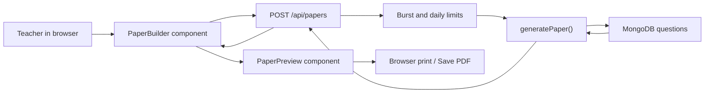

# AutoPaper Project Guide

This guide explains how AutoPaper works, why its main pieces exist, and where
to make changes. It is written for a developer who understands basic
JavaScript, React, Node.js, and MongoDB but is new to this codebase.

## 1. What AutoPaper Does

AutoPaper is a full-stack Next.js application that:

1. Reads questions from MongoDB.
2. Lets a user choose a subject, paper type, chapter, and difficulty.
3. Selects questions using paper blueprints and chapter mark quotas.
4. Returns a structured paper to the browser.
5. Converts the paper into one or more A4-sized pages.
6. Opens the browser print dialog so the paper can be printed or saved as PDF.

Supported paper modes:

- Full question paper
- Chapter-wise 15-mark test

Supported subjects:

- Science and Technology I
- Science and Technology II
- Mathematics I
- Mathematics II

History and Geography are visible as disabled "Coming soon" choices.

## 2. Technology Stack

| Area | Technology | Purpose |
| --- | --- | --- |
| Framework | Next.js App Router | Frontend, server routes, metadata, deployment |
| UI | React and Tailwind CSS | Form, pages, responsive layout |
| Language | TypeScript | Static type checking |
| Database | MongoDB | Question bank and daily quota records |
| ODM | Mongoose | Schemas, queries, connection management |
| Validation | Zod | API request and environment validation |
| Math rendering | KaTeX | Mathematical expressions in questions |
| Printing | Browser print API and CSS | A4 preview and PDF output |
| Testing | Vitest | Difficulty and rate-limit unit tests |
| Analytics | Vercel Analytics and GA4 | Production usage analytics |
| 3D homepage | React Three Fiber | Animated atom model |

## 3. High-Level Architecture



The project is a single Next.js application. There is no separate Express
server. Next.js API route handlers are the backend.

## 4. Directory Map

```text
app/
  api/
    health/route.ts       Database health endpoint
    papers/route.ts       Paper generation endpoint
  create/page.tsx         Paper builder page
  layout.tsx              Global metadata, fonts, analytics
  page.tsx                Homepage
  globals.css             Website and A4 print styles

components/
  auth/                  Account forms and session-aware header controls
  paper/
    paper-builder.tsx     Form state and API request
    paper-preview.tsx     A4 pagination, preview, and printing
  header.tsx              Main navigation
  atom-3d.tsx             Homepage 3D animation
  background-pattern.tsx  Grid background
  ui/button.tsx           Reusable button component

lib/
  db.ts                   Cached MongoDB connection
  paper/
    difficulty.ts         Difficulty percentages and rounding
    generate.ts           Main question-selection algorithm
    patterns.ts           Paper blueprints and chapter quotas
    types.ts              Shared TypeScript types and validators
  server/
    auth.ts               Resolve verified users from JWT cookies
    auth-validation.ts    Registration and password validation
    daily-paper-limit.ts  Five successful papers per user per UTC day
    email.ts              Resend verification/reset emails
    env.ts                Server environment validation
    jwt.ts                Signed session tokens and cookie options
    logger.ts             Structured JSON logs
    password.ts           Scrypt password hashing
    rate-limit.ts         Short in-memory burst limiter
    request.ts            Safe JSON body reader
    tokens.ts             One-time verification/reset tokens

models/
  question.ts             Question collection schema
  paper-generation-quota.ts
  user.ts                 Account and verification state

scripts/
  create-indexes.mjs      Production MongoDB indexes

tests/
  difficulty.test.ts
  rate-limit.test.ts
```

## 5. Complete Paper Generation Flow

Before this flow, the user must register, explicitly verify the email link,
and sign in. `/create` and `POST /api/papers` both reject unverified or missing
sessions. The JWT is stored in an HttpOnly cookie and is checked against the
current user's `sessionVersion`.

### Step 1: The user fills in the form

`components/paper/paper-builder.tsx` stores these values in React state:

- Paper mode
- Subject
- Chapter, for chapter tests
- Difficulty
- School name
- Exam date
- Uploaded logo

### Step 2: The browser calls the API

`handleGenerate()` sends:

```json
{
  "subject": "math-1",
  "mode": "chapter-test",
  "chapter": 1,
  "difficulty": "medium"
}
```

to:

```text
POST /api/papers
```

### Step 3: The API protects and validates the request

`app/api/papers/route.ts`:

1. Creates a request ID.
2. Finds the client IP.
3. Applies the 10-requests-per-minute burst limit.
4. Requires JSON.
5. Rejects bodies larger than 1 KB.
6. Parses and validates the request with Zod.
7. Validates the chapter for chapter tests.
8. Reserves one daily generation slot.

### Step 4: The server generates the paper

`generatePaper()`:

1. Connects to MongoDB.
2. Queries the selected subject and optional chapter.
3. Normalizes and sanitizes database records.
4. Loads the correct paper blueprint.
5. Calculates the requested difficulty distribution.
6. Selects questions.
7. Falls back to another difficulty when the preferred level is unavailable.
8. Calculates total marks.
9. Verifies that a chapter test is exactly 15 marks.

### Step 5: The API returns the paper

Successful response:

```json
{
  "paper": {
    "subject": "math-1",
    "mode": "chapter-test",
    "difficulty": "medium",
    "chapter": 1,
    "generatedAt": "2026-06-14T10:00:00.000Z",
    "totalMarks": 15,
    "sections": []
  },
  "dailyRemaining": 4
}
```

If generation fails after reserving a daily slot, the API releases the slot.

### Step 6: The browser paginates the paper

`PaperPreview` creates hidden paper content, renders KaTeX, waits for images
and fonts, and moves each question into A4 page elements until a page is full.

### Step 7: The user prints

`handlePrint()` temporarily moves the printable root directly under
`document.body`, applies print-only CSS, and calls `window.print()`.

## 6. Database Schema

### Question document

File: `models/question.ts`

Example:

```json
{
  "questionText": "For simultaneous equations...",
  "questionType": "1a",
  "options": ["7", "-7", "1/7", "-1"],
  "subject": "Mathematics - I",
  "chapter": 1,
  "chapterName": "Linear Equations in Two Variables",
  "grade": 10,
  "difficulty": "easy",
  "marks": 1,
  "category": null,
  "createdBy": null,
  "institutionId": null,
  "hasImage": "false",
  "image": ""
}
```

Important fields:

| Field | Meaning |
| --- | --- |
| `questionText` | Question HTML or plain text |
| `questionType` | Blueprint category, such as `MCQ`, `2m`, or `3b` |
| `options` | MCQ choices |
| `subject` | Internal key or supported display name |
| `chapter` | One-based chapter number |
| `chapterName` | Optional readable chapter name |
| `difficulty` | `easy`, `medium`, or `hard` |
| `marks` | Marks awarded for the question |
| `hasImage` | `yes`, `no`, `true`, or `false` |
| `image` | External HTTP or HTTPS image URL |

Accepted subject values:

| Internal value | Display value |
| --- | --- |
| `science1` | `Science and Technology - I` |
| `science2` | `Science and Technology - II` |
| `math-1` | `Mathematics - I` |
| `math-2` | `Mathematics - II` |

### Daily quota document

File: `models/paper-generation-quota.ts`

```json
{
  "_id": "hashed-ip-and-date",
  "count": 3,
  "expiresAt": "2026-06-15T00:00:00.000Z"
}
```

The `_id` is a SHA-256 hash. The raw IP address is not stored.

MongoDB automatically removes expired records through the `quota_expiry` TTL
index.

## 7. Paper Blueprints

File: `lib/paper/patterns.ts`

`PAPER_PATTERNS` is the main configuration for full papers.

Each subject contains:

- `label`: Printed subject name.
- `chapterQuota`: Maximum marks selectable from each chapter.
- `sections`: Required question types and counts.

Example:

```ts
'math-1': {
  label: 'Mathematics - I',
  chapterQuota: [12, 12, 8, 8, 8, 12],
  sections: [
    { questionType: '5', count: 2, title: 'Answer The Following' },
    // ...
  ],
}
```

The first item in `chapterQuota` belongs to chapter 1, the second to chapter 2,
and so on.

### Chapter test blueprint

Science:

| Type | Count | Marks each | Total |
| --- | ---: | ---: | ---: |
| MCQ | 3 | 1 | 3 |
| Objective | 2 | 1 | 2 |
| 2-mark | 2 | 2 | 4 |
| 3-mark | 2 | 3 | 6 |
| Total | 9 | | 15 |

Mathematics uses corresponding types:

- `1a` for MCQ
- `1b` for objective
- `2b` for 2-mark
- `3b` for 3-mark

## 8. Difficulty System

File: `lib/paper/difficulty.ts`

Target profiles:

| Selected level | Easy | Medium | Hard |
| --- | ---: | ---: | ---: |
| Easy | 80% | 20% | 0% |
| Medium | 20% | 60% | 20% |
| Hard | 15% | 30% | 55% |

These percentages are preferences, not hard database requirements.

For each section, AutoPaper:

1. Converts percentages into whole question counts.
2. Tries to select the preferred difficulty.
3. Selects another available difficulty if the preferred one is missing.

It still fails if there are not enough questions of the required question
type, or if the full-paper chapter quota cannot be satisfied.

## 9. Function Reference

### `lib/paper/difficulty.ts`

#### `allocateDifficultyCounts(total, selectedDifficulty)`

Converts a percentage profile into whole-number counts.

Example:

```ts
allocateDifficultyCounts(10, 'medium')
// { easy: 2, medium: 6, hard: 2 }
```

It first floors each percentage result, then assigns remaining questions to
the largest decimal remainders. This guarantees that all returned counts add
up to `total`.

### `lib/paper/patterns.ts`

#### `getChapterCount(subject)`

Returns the number of chapters configured for a subject by reading the length
of its `chapterQuota` array.

### `lib/paper/types.ts`

#### `isSubject(value)`

Type guard used by Zod validation. Returns `true` only for supported internal
subject keys.

#### `isPaperMode(value)`

Returns `true` for `full` or `chapter-test`.

#### `isDifficulty(value)`

Returns `true` for `easy`, `medium`, or `hard`.

### `lib/paper/generate.ts`

#### `PaperGenerationError`

Custom error class for expected generation problems, such as insufficient
questions. The API returns these as HTTP 422 rather than hiding them as an
unknown server error.

#### `sanitizeQuestionMarkup(value)`

Removes unsafe HTML from question text and options. It allows only basic text
formatting tags required by the question bank.

This is necessary because `PaperPreview` eventually renders question HTML
with `dangerouslySetInnerHTML`.

#### `normalizeImageUrl(value)`

Accepts only valid `http:` and `https:` image URLs. Invalid URLs and other
protocols return `undefined`.

#### `shuffle(items)`

Returns a shuffled copy using the Fisher-Yates algorithm. It never mutates the
original array.

#### `getDifficultySequence(count, difficulty)`

Calls `allocateDifficultyCounts()`, expands the counts into a list such as:

```text
medium, easy, medium, hard, medium
```

and shuffles the list so difficulty positions are not predictable.

#### `selectQuestions(...)`

Used for full papers.

Responsibilities:

1. Filter questions to one required question type.
2. Try up to 100 randomized selections.
3. Prefer the requested difficulty sequence.
4. Fall back to another difficulty when necessary.
5. Track remaining marks for every chapter.
6. Prevent a chapter from exceeding its configured quota.

It throws `PaperGenerationError` if it cannot complete the section.

Inside this function, `fitsChapterQuota(question)` checks that the question's
chapter exists in the quota array and still has enough remaining marks.

#### `selectChapterQuestions(...)`

Used for 15-mark chapter tests.

It filters to one question type, follows the difficulty sequence, and falls
back to another difficulty if needed. Chapter filtering already happened in
the MongoDB query, so no chapter quota array is needed.

#### `generatePaper(subject, mode, chapter, difficulty)`

The central server function.

Responsibilities:

1. Connect to MongoDB.
2. Translate the internal subject key into accepted database values.
3. Query questions with a five-second MongoDB timeout.
4. Limit the query to 5,000 records.
5. Sanitize text and normalize images.
6. Use either the full-paper or chapter-test picker.
7. Calculate total marks.
8. Verify chapter tests total exactly 15.
9. Return a `GeneratedPaper`.

### `lib/db.ts`

#### `connectToDatabase()`

Creates or reuses a Mongoose connection.

The connection and in-progress connection promise are cached on `global`.
This prevents Next.js development reloads and serverless warm invocations from
opening unnecessary connections.

Important settings:

- Automatic index creation is disabled.
- Query buffering is disabled.
- Pool maximum is 10 connections.
- Connection and server selection timeouts are 8 seconds.
- Socket timeout is 15 seconds.

### `lib/server/env.ts`

#### `getServerEnv()`

Validates server environment variables once and caches the result.

It requires `MONGODB_URI` to start with `mongodb://` or `mongodb+srv://`.
Invalid configuration throws a clear startup/runtime error.

### `lib/server/rate-limit.ts`

#### `getClientIp(request)`

Reads the first `x-forwarded-for` address, then `x-real-ip`, then uses
`unknown`.

#### `checkRateLimit(key, limit, windowMs, now)`

Implements a fixed-window, in-memory limiter.

The API uses it for 10 generation requests per IP per minute.

This limiter is process-local. It is burst protection, not the persistent
daily quota.

#### `clearRateLimitStore()`

Clears the in-memory map. It exists mainly so tests can start with clean state.

### `lib/server/daily-paper-limit.ts`

#### `getUtcDay(now)`

Returns the UTC date as `YYYY-MM-DD`.

#### `getNextUtcDay(now)`

Returns midnight at the start of the next UTC day.

#### `getQuotaId(clientIp, now)`

Hashes the client IP and UTC date into a quota document ID.

#### `reserveDailyPaper(clientIp, now)`

Atomically increments the daily count only while it is below five.

It returns:

```ts
{
  allowed: boolean
  remaining: number
  quotaId: string
  resetAt: Date
}
```

A duplicate-key race means another request reached the limit first, so it is
treated as denied.

#### `releaseDailyPaper(quotaId)`

Decrements a reserved count when generation fails. This means only successful
papers consume the daily allowance.

### `lib/server/logger.ts`

#### `writeLog(level, event, context)`

Creates one-line JSON log entries with a timestamp, level, event name, and
context.

#### `logInfo(event, context)`

Writes an informational structured log.

#### `logError(event, error, context)`

Writes a structured error. Stack traces are omitted in production.

### Authentication server modules

#### `hashPassword(password)`

Creates a random salt and derives a 64-byte password key with Node.js
`scrypt`. MongoDB stores the algorithm, salt, and derived key, never the plain
password.

#### `verifyPassword(password, storedHash)`

Derives a key using the stored salt and compares it with
`timingSafeEqual()` to reduce timing attacks.

#### `createOneTimeToken()`

Creates a cryptographically random verification or password-reset token and
returns both the raw token and its SHA-256 hash. Only the hash is stored.

#### `hashOneTimeToken(token)`

Hashes a token received from an email link so it can be compared with MongoDB.

#### `createSessionToken(user, now)`

Creates a signed HS256 JWT containing the user ID, email, name, session
version, issue/expiry times, issuer, audience, and a unique token ID. Sessions
expire after seven days.

#### `verifySessionToken(token, now)`

Verifies the HMAC signature with a timing-safe comparison, validates required
claims, and rejects expired or future-issued tokens.

#### `getUserFromRequest(request)`

Reads the HttpOnly session cookie from an API request, verifies the JWT, and
loads the current verified user from MongoDB.

#### `getCurrentUser()`

Server-component version of session lookup using Next.js `cookies()`.

#### `sendVerificationEmail(...)`

Builds a 24-hour confirmation URL and sends it through the Resend HTTPS API.
The email link opens a confirmation page; an explicit button consumes the
token so automated email scanners do not activate accounts.

#### `sendPasswordResetEmail(...)`

Sends a one-hour password-reset URL through Resend.

#### `readJsonBody(request)`

Requires JSON, limits auth request bodies to 4 KB, and returns controlled 400,
413, or 415 responses for invalid input.

### Authentication API routes

| Route | Purpose |
| --- | --- |
| `POST /api/auth/register` | Create an unverified account and send email |
| `POST /api/auth/verify-email` | Consume the verification token and sign in |
| `POST /api/auth/resend-verification` | Send a new 24-hour link |
| `POST /api/auth/login` | Verify credentials and set the JWT cookie |
| `POST /api/auth/logout` | Clear the JWT cookie |
| `GET /api/auth/me` | Return the current verified user |
| `POST /api/auth/forgot-password` | Send a reset link without revealing account existence |
| `POST /api/auth/reset-password` | Set a new password and invalidate older sessions |

### `lib/utils.ts`

#### `cn(...inputs)`

Combines conditional class names with `clsx`, then resolves conflicting
Tailwind classes with `tailwind-merge`.

### `app/api/papers/route.ts`

#### `jsonResponse(body, status, requestId)`

Creates a consistent JSON response with no-store caching and the request ID.

#### `POST(request)`

The complete paper-generation API controller. It handles validation, rate
limits, daily quota reservation, generation, success headers, known errors,
unknown errors, and quota rollback.

HTTP responses:

| Status | Meaning |
| --- | --- |
| 200 | Paper generated |
| 400 | Invalid input or chapter |
| 413 | Body is too large |
| 415 | Content type is not JSON |
| 422 | Valid request, but the question bank cannot satisfy it |
| 429 | Burst or daily limit reached |
| 500 | Unexpected server failure |

### `app/api/health/route.ts`

#### `GET()`

Connects to MongoDB, sends an admin ping, and returns response time.

- HTTP 200 means the database is available.
- HTTP 503 means the database is unavailable.

### `components/paper/paper-builder.tsx`

#### `PaperBuilder()`

Main interactive form component. It owns all builder state and renders the
preview after a successful API response.

#### `handleLogoChange(event)`

Validates uploaded logos:

- PNG, JPEG, or WebP only
- Maximum 2 MB

It reads the image as a browser data URL. The file is not uploaded to the
server.

#### `resetLogo()`

Restores the bundled AutoPaper logo and clears the file input.

#### `handleGenerate()`

Builds the API request, calls `/api/papers`, updates the remaining daily count,
stores the generated paper, and displays errors.

### `components/paper/paper-preview.tsx`

#### `HtmlText({ className, html })`

Renders already-sanitized question HTML and marks it with `data-math` so KaTeX
can process it.

#### `QuestionItem({ number, question })`

Renders one question. It also renders up to four choices for `MCQ` and `1a`
types, and an image when the normalized image flag is `yes`.

#### `waitForImages(container)`

Waits until every image has loaded or failed. Pagination must wait because an
image changes question height.

#### `PaperPreview(...)`

Owns A4 pagination, responsive preview scaling, and printing.

Important references:

- `sourceRef`: hidden original content
- `pagesRef`: generated A4 pages
- `printRootRef`: printable container
- `previewViewportRef`: available responsive width

#### `paginate()`

Nested inside the `useEffect` in `PaperPreview`.

Sequence:

1. Clear previous pages.
2. Dynamically load KaTeX auto-render.
3. Render math expressions.
4. Wait for fonts and images.
5. Clone hidden source items.
6. Create the first A4 page with a header.
7. Add items until the current page overflows.
8. Move the overflowing item to a new page.
9. Move a stranded section heading with its first question.
10. Scale the preview to fit the available browser width.

Only the first page receives the school logo and exam header.

#### `createPage()`

Nested pagination helper. Creates the A4 page, first-page header, content
container, and scaled preview frame.

#### `updatePreviewScale()`

Nested pagination helper. Converts 210 mm into CSS pixels and calculates a
scale that prevents horizontal scrolling.

#### `handlePrint()`

Moves the print root under the body, enables print CSS, calls
`window.print()`, then restores the original DOM position after printing.

Inside it, `restorePrintRoot()` removes print mode and returns the printable
element to its original parent after the browser print dialog closes.

### Other UI functions

#### `Header()`

Displays the logo, public navigation, and Create Paper button.

#### `Button()`

Wraps Base UI's button and applies reusable variant and size classes.

#### `BackgroundPattern()`

Renders the fixed graph-paper SVG background.

#### `Atom()`

Builds and animates the homepage atom meshes.

#### `AtomCanvas()`

Creates the Three.js canvas, lights, camera, atom, and orbit controls.

#### `RootLayout({ children })`

Applies fonts, global CSS, metadata, and production-only Vercel Analytics.

#### `Home()`

Renders the landing page, workflow explanation, currently available subjects,
call-to-action sections, and footer. It loads `AtomCanvas` dynamically with
server-side rendering disabled because Three.js requires the browser.

#### `CreatePaperPage()`

Composes the background, shared header, and `PaperBuilder` for `/create`.

#### `AboutPage()`

Renders the product explanation and current scope for `/about`.

#### `ContactPage()`

Reads `NEXT_PUBLIC_CONTACT_EMAIL` and displays either a mail link or a clear
configuration message.

#### `ErrorPage({ error, reset })`

Acts as the App Router error boundary. It logs the client error and lets the
user retry the failed route segment through `reset()`.

#### `NotFound()`

Renders the application-wide 404 page.

#### `robots()`

Allows public pages, blocks `/api/` from search indexing, and includes the
sitemap URL when the public application URL is configured.

#### `sitemap()`

Returns metadata for the home, create, about, and contact routes. It returns an
empty list when `NEXT_PUBLIC_APP_URL` is missing.

#### `LoginPage()`

Shows the login form and redirects an already authenticated user to `/create`.

#### `SignInPage()`

Redirects the legacy `/signin` URL to `/login`.

## 10. A4 Pagination and Print CSS

The relevant styles start around the `.paper-preview-shell` section in
`app/globals.css`.

Important classes:

| Class | Responsibility |
| --- | --- |
| `.paper-preview-shell` | Preview wrapper |
| `.paper-print-root` | Printable root and responsive viewport |
| `.paper-pages` | Holds all scaled pages |
| `.paper-page-frame` | Preserves scaled page dimensions |
| `.paper-a4-page` | Exact 210 mm by 297 mm paper |
| `.paper-exam-header` | First-page logo, title, date, and marks |
| `.paper-page-content` | Question content area |
| `.paper-item` | Atomic pagination item |
| `.paper-source` | Hidden unpaginated source |

The `@page` rule forces A4 with zero browser margins. The page component
provides its own internal margins.

During printing, `body.paper-printing` hides everything except
`.paper-print-root`.

## 11. Security and Reliability

Current protections:

- Zod request validation
- Environment validation
- 1 KB request body limit
- JSON-only generation endpoint
- HTML sanitization
- HTTP/HTTPS-only question images
- MongoDB query timeout
- Query result limit
- Burst rate limiting
- Persistent daily generation limit
- Structured server logs
- No-store API responses
- Security headers in `next.config.mjs`
- Request IDs for troubleshooting
- Scrypt password hashing with unique salts
- Signed HS256 JWT sessions in HttpOnly, SameSite cookies
- Verified-email requirement for protected pages and APIs
- Hashed, expiring, one-time email verification and reset tokens
- Session invalidation after password reset
- Generic forgot-password responses to reduce account enumeration
- Explicit verification action to avoid email-scanner link consumption

## 12. Environment Variables

```env
MONGODB_URI=mongodb+srv://...
JWT_SECRET=long-random-secret
NEXT_PUBLIC_APP_URL=https://your-domain.com
RESEND_API_KEY=re_xxxxxxxxx
EMAIL_FROM="AutoPaper <noreply@your-domain.com>"
NEXT_PUBLIC_CONTACT_EMAIL=you@example.com
NEXT_PUBLIC_GA_MEASUREMENT_ID=G-XXXXXXXXXX
```

| Variable | Required | Used by |
| --- | --- | --- |
| `MONGODB_URI` | Yes | Server database connection and index script |
| `JWT_SECRET` | Yes | Signing and verifying session JWTs |
| `NEXT_PUBLIC_APP_URL` | Yes | Email links, metadata, sitemap, robots |
| `RESEND_API_KEY` | Yes | Verification and password-reset email API |
| `EMAIL_FROM` | Yes | Verified sender identity in Resend |
| `NEXT_PUBLIC_CONTACT_EMAIL` | No | Contact page |
| `NEXT_PUBLIC_GA_MEASUREMENT_ID` | No | Google Analytics 4 web tracking |

Never commit `.env.local`.

## 13. Development Commands

```powershell
corepack pnpm install
corepack pnpm dev
corepack pnpm lint
corepack pnpm typecheck
corepack pnpm test
corepack pnpm build
corepack pnpm check
corepack pnpm db:indexes
```

On Windows, `corepack pnpm` avoids the PowerShell `npm.ps1` execution-policy
problem.

`corepack pnpm check` runs lint, type checking, tests, and the production build.

## 14. How to Make Common Changes

### Add or change a full-paper blueprint

Edit `PAPER_PATTERNS` in `lib/paper/patterns.ts`.

Verify:

1. Every `questionType` exists in the database.
2. Each question's `marks` value matches its type.
3. Chapter quota totals can satisfy every section.
4. The question bank contains enough records.

### Change the 15-mark test

Edit `CHAPTER_TEST_PATTERNS` in `lib/paper/patterns.ts`.

The selected questions must still add up to 15, or `generatePaper()` rejects
the result.

### Change difficulty percentages

Edit `DIFFICULTY_PROFILES` in `lib/paper/difficulty.ts`.

Each profile should total `1`.

Update `tests/difficulty.test.ts` and run:

```powershell
corepack pnpm test
```

### Add a new subject

Update all of these:

1. `SUBJECTS` in `lib/paper/types.ts`
2. `PAPER_PATTERNS` in `lib/paper/patterns.ts`
3. `subjectDatabaseValues` in `lib/paper/generate.ts`
4. Subject enum in `models/question.ts`
5. `subjectOptions` in `components/paper/paper-builder.tsx`
6. The production question collection

Then run the full check.

### Add a new question type

Update:

1. The `questionType` enum in `models/question.ts`
2. The appropriate paper pattern
3. `QuestionItem` if it needs special rendering

### Change daily generation allowance

Edit `DAILY_PAPER_LIMIT` in `lib/server/daily-paper-limit.ts`.

Also update the visible text in `PaperBuilder`.

### Change the A4 layout

Edit:

- Pagination behavior in `PaperPreview`
- Paper dimensions, spacing, typography, and print rules in `app/globals.css`

Do not change `.paper-a4-page` away from 210 mm by 297 mm if A4 output is
required.

## 15. Testing Strategy

Current automated tests cover:

- Difficulty count allocation
- Burst rate-limit behavior and reset

Important manual checks before deployment:

1. Generate every subject in full-paper mode.
2. Generate easy, medium, and hard papers.
3. Generate a chapter test for every subject.
4. Test a chapter with missing preferred difficulty questions.
5. Upload each supported logo format.
6. Preview on desktop and mobile widths.
7. Print or save a paper with multiple A4 pages.
8. Verify only the first page has the header.
9. Verify `/api/health` returns HTTP 200.
10. Verify the sixth successful daily generation is rejected.

## 16. Production Deployment

1. Configure environment variables.
2. Import the `questions` collection.
3. Run:

```powershell
corepack pnpm db:indexes
corepack pnpm check
```

4. Deploy the whole Next.js project.
5. Check `/api/health`.
6. Generate and print sample papers.

The daily quota is shared through MongoDB and works across multiple instances.
The one-minute burst limiter is stored in process memory. Replace it with
Redis or a provider-managed limiter if strict cross-instance burst limiting is
required.

## 17. Interview Explanation

A short explanation:

> AutoPaper is a full-stack Next.js application backed by MongoDB. The user
> selects a subject, paper mode, chapter, and difficulty. A protected API route
> validates the request, applies burst and daily limits, then calls a
> blueprint-driven selection algorithm. The algorithm satisfies section counts
> and chapter mark quotas while preferring a configurable difficulty mix. The
> browser sanitizes and renders the returned paper, uses KaTeX for mathematics,
> dynamically paginates content into exact A4 pages, and uses print CSS to
> export all pages as a PDF.

Core engineering decisions to mention:

- Paper patterns are configuration rather than duplicated route logic.
- MongoDB connection caching prevents excess connections.
- Difficulty is adaptive so sparse question banks can still produce papers.
- Chapter quotas are hard constraints because they define paper balance.
- HTML is sanitized before browser rendering.
- Daily usage is stored atomically in MongoDB.
- PDF generation uses browser-native printing to preserve A4 layout.

## 18. Known Scope

- No admin question-bank interface
- No answer-key generation
- No saved paper history
- No shared Redis burst limiter
- History and Geography are not active

These are product additions, not requirements for the current generation and
printing flow.
